Seurat_TD
================
Sida Chen

# IFE001

``` r
# Load datasets
IFE001.data <- Read10X(data_dir <- '~/Documents/cellranger/IFE001/outs/filtered_feature_bc_matrix')
# Initialize Seurat Object
IFE001 <- CreateSeuratObject(counts = IFE001.data, project = 'IFE', min.cells = 3, min.features = 200)
```

## Normalizing data — Log normalization, scale = 10000

``` r
IFE001 <- NormalizeData(IFE001)
```

    ## Normalizing layer: counts

## Scaling the data

``` r
all.genes_IFE001 <- rownames(IFE001)
IFE001 <- ScaleData(IFE001, features = all.genes_IFE001)
```

    ## Centering and scaling data matrix

## Linear Dimentional Reduction

``` r
IFE001 <- FindVariableFeatures(IFE001, selection.method = "vst", nfeatures = 2000)
```

    ## Finding variable features for layer counts

``` r
IFE001 <- RunPCA(IFE001, features = VariableFeatures(object = IFE001))
```

    ## PC_ 1 
    ## Positive:  Nusap1, Top2a, Ube2c, Birc5, Cenpf, Cdk1, Spc25, Cdca3, Kif11, Knl1 
    ##     Mki67, Anln, Hmmr, Pbk, Racgap1, Spc24, Tpx2, Cdca8, Ccna2, Ckap2 
    ##     Prc1, Kif23, Sgo1, Ccnb2, Esco2, Aurkb, H1f5, Cenpa, Ect2, Mis18bp1 
    ## Negative:  Krt77, Sbsn, Elovl4, Krtdap, Spink5, Skint6, Krt10, Nectin4, Abca12, Skint5 
    ##     Mboat2, Dsg1a, Agpat4, Hal, Skint3, Ly6g6c, Dgat2, Dsc1, Ank, Skint10 
    ##     Psapl1, Skint9, Lipm, Fads2b, Gm94, Ptgs1, Orm1, Klk5, Sdr16c6, Klk7 
    ## PC_ 2 
    ## Positive:  Cmss1, Ccdc3, Nckap5, Pde4d, Lrrc7, Rad51b, Bmpr1b, Immp2l, Thsd4, Nhs 
    ##     Rerg, Creb5, Ror1, Lama1, Tspear, Tbc1d4, Plcb1, Atg4a, Prr16, Garin4 
    ##     Fhit, Dpyd, Agmo, Grip1, Slc35f1, Adamtsl1, Tenm3, Nrg1, Icam1, Adgrv1 
    ## Negative:  Spink5, Elovl4, Psapl1, Dgat2, Hal, Mboat2, Nectin4, Ly6g6c, Sbsn, Gm94 
    ##     Dsc1, Orm1, Klk5, Gltp, Calm4, Dkkl1, Dnase1l3, Map2, Susd2, Krt77 
    ##     Skint3, Sdr16c6, Kctd12, Klk7, 2310050C09Rik, Krtdap, Agpat4, Calm1, Cst6, Gsdma 
    ## PC_ 3 
    ## Positive:  Cmss1, Flg2, Lor, Map2, Flg, Krt23, Lars2, Klk7, Marchf3, Nectin3 
    ##     Anxa9, Nebl, Crct1, Tmprss11f, Cnfn, Lypd5, Eps8l1, Wfdc21, Lce1m, Serpina12 
    ##     Csta1, Plekhg1, Niban2, Shroom3, Plxdc2, Cgn, Nccrp1, Srgap2, Cyp2b19, Gas7 
    ## Negative:  Lgals7, Sfn, Lgals3, Dstn, Ly6d, Jund, Atp5d, Atp5g1, Itm2b, Hmgb1 
    ##     Tacstd2, Perp, Prdx2, Apoc1, Dynll1, 1810037I17Rik, Sdc1, Trim29, Rab25, Crip2 
    ##     Hspb1, Serpinb5, Junb, Cstb, Ndufa4l2, Dbi, Pycard, Higd1a, Dapl1, Ier2 
    ## PC_ 4 
    ## Positive:  Skint6, Fads2b, Ghr, Dlg2, Skint5, Tnik, Micu1, Krt1, Skint4, Skint9 
    ##     Notch3, Sptlc3, Plekha6, Tmprss4, D7Ertd443e, Scel, Hpgds, Acsl1, Krt10, Slc9a9 
    ##     Acer1, Dsc3, Slc12a2, Itgb5, Ankrd35, Tprg, Gm9750, Ptgs1, Pla2g4f, Man2a1 
    ## Negative:  Flg, Crct1, Anxa9, Csta1, Rnf227, Flg2, Cnfn, Lypd5, Krt23, Serpina12 
    ##     Nccrp1, Ctsl, Smpd3, Il18, Klk7, Asprv1, Cysrt1, Btc, Ly6m, Wfdc21 
    ##     Prdm1, Lor, Alox12b, Lce1m, Sdr9c7, Spns2, Nectin3, Myzap, Lipn, Kprp 
    ## PC_ 5 
    ## Positive:  Fam25c, Gm94, Calm4, Krt10, Dmkn, Krtdap, Flg2, Krt1, 2310050C09Rik, Csta1 
    ##     Mt4, Wfdc21, Asprv1, Serpina12, Rab25, Dapl1, Crct1, Lor, Nccrp1, Cysrt1 
    ##     Cnfn, Ndufa4l2, Clic3, Ggct, Hal, Lypd5, Orm1, Gjb5, Ly6d, Flg 
    ## Negative:  Ctnnd2, Ptprc, Vim, Runx3, Fcer1g, Lcp1, Fxyd5, Cd52, S100a4, Laptm5 
    ##     Emp3, Ncald, Fyb, Dennd4a, Elmo1, Gpr141, Lgals1, Prkcb, St8sia1, Lpar3 
    ##     Dock10, Soat1, Cd53, Mir142hg, Coro1a, Cd244a, Alcam, Ikzf1, Zeb1, Dock2

``` r
print(IFE001[["pca"]], dims = 1:5, nfeature = 5)
```

    ## PC_ 1 
    ## Positive:  Nusap1, Top2a, Ube2c, Birc5, Cenpf 
    ## Negative:  Krt77, Sbsn, Elovl4, Krtdap, Spink5 
    ## PC_ 2 
    ## Positive:  Cmss1, Ccdc3, Nckap5, Pde4d, Lrrc7 
    ## Negative:  Spink5, Elovl4, Psapl1, Dgat2, Hal 
    ## PC_ 3 
    ## Positive:  Cmss1, Flg2, Lor, Map2, Flg 
    ## Negative:  Lgals7, Sfn, Lgals3, Dstn, Ly6d 
    ## PC_ 4 
    ## Positive:  Skint6, Fads2b, Ghr, Dlg2, Skint5 
    ## Negative:  Flg, Crct1, Anxa9, Csta1, Rnf227 
    ## PC_ 5 
    ## Positive:  Fam25c, Gm94, Calm4, Krt10, Dmkn 
    ## Negative:  Ctnnd2, Ptprc, Vim, Runx3, Fcer1g

``` r
VizDimLoadings(IFE001, dims = 1:2, reduction = "pca")
```

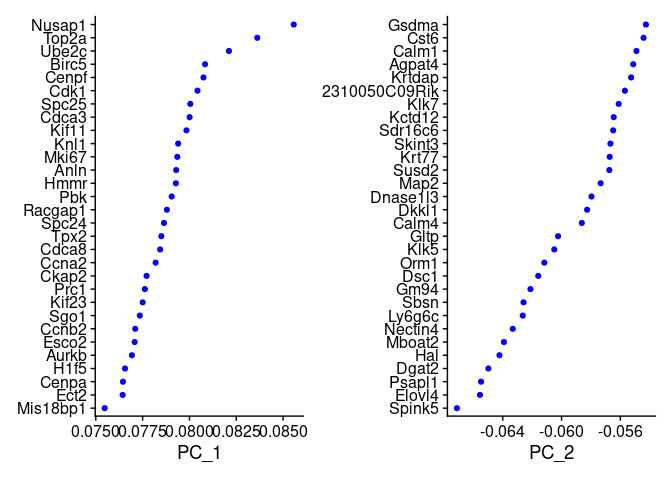<!-- -->

``` r
DimPlot(IFE001, reduction = "pca") + NoLegend()
```

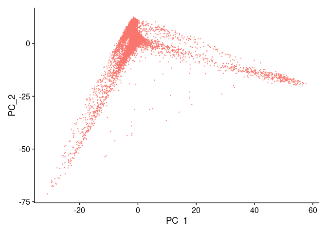<!-- -->

## Cluster

``` r
IFE001 <- FindNeighbors(IFE001, dims = 1:10)
```

    ## Computing nearest neighbor graph

    ## Computing SNN

``` r
IFE001 <- FindClusters(IFE001, resolution = 0.5)
```

    ## Modularity Optimizer version 1.3.0 by Ludo Waltman and Nees Jan van Eck
    ## 
    ## Number of nodes: 10154
    ## Number of edges: 327142
    ## 
    ## Running Louvain algorithm...
    ## Maximum modularity in 10 random starts: 0.8998
    ## Number of communities: 16
    ## Elapsed time: 0 seconds

``` r
head(Idents(IFE001), 5)
```

    ## AAACCCAAGCCTCACG-1 AAACCCACACACGGAA-1 AAACCCACACCGTACG-1 AAACCCACACGCTGAC-1 
    ##                  3                  0                  0                 14 
    ## AAACCCACAGGGATAC-1 
    ##                  0 
    ## Levels: 0 1 2 3 4 5 6 7 8 9 10 11 12 13 14 15

## Non-linear dimensional reduction (UMAP/tSNE)

``` r
IFE001 <- RunUMAP(IFE001, dims = 1:10)
```

    ## Warning: The default method for RunUMAP has changed from calling Python UMAP via reticulate to the R-native UWOT using the cosine metric
    ## To use Python UMAP via reticulate, set umap.method to 'umap-learn' and metric to 'correlation'
    ## This message will be shown once per session

    ## 00:58:35 UMAP embedding parameters a = 0.9922 b = 1.112

    ## 00:58:35 Read 10154 rows and found 10 numeric columns

    ## 00:58:35 Using Annoy for neighbor search, n_neighbors = 30

    ## 00:58:35 Building Annoy index with metric = cosine, n_trees = 50

    ## 0%   10   20   30   40   50   60   70   80   90   100%

    ## [----|----|----|----|----|----|----|----|----|----|

    ## **************************************************|
    ## 00:58:36 Writing NN index file to temp file /tmp/RtmpNXUUFN/file24dfa2cd04c94
    ## 00:58:36 Searching Annoy index using 1 thread, search_k = 3000
    ## 00:58:38 Annoy recall = 100%
    ## 00:58:39 Commencing smooth kNN distance calibration using 1 thread with target n_neighbors = 30
    ## 00:58:40 Initializing from normalized Laplacian + noise (using RSpectra)
    ## 00:58:40 Commencing optimization for 200 epochs, with 415482 positive edges
    ## 00:58:42 Optimization finished

``` r
DimPlot(IFE001, reduction = "umap")
```

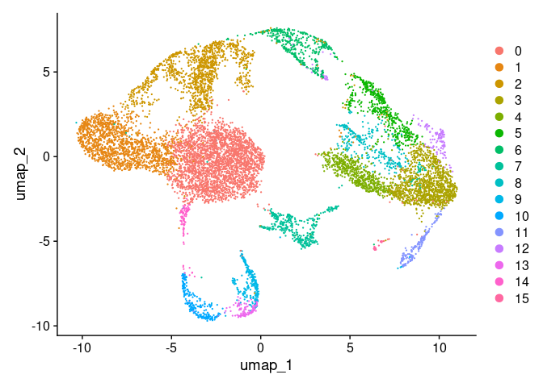<!-- -->

``` r
saveRDS(IFE001, file = "./IFE001_umap.rds")
```

## Cluster biomarkers & DEGs

# IFE002

``` r
# Load datasets
IFE002.data <- Read10X(data_dir <- '~/Documents/cellranger/IFE002/outs/filtered_feature_bc_matrix')
# Initialize Seurat Object
IFE002 <- CreateSeuratObject(counts = IFE002.data, project = 'IFE', min.cells = 3, min.features = 200)
```

## Normalizing data — Log normalization, scale = 10000

``` r
IFE002 <- NormalizeData(IFE002)
```

    ## Normalizing layer: counts

## Scaling the data

``` r
all.genes_IFE002 <- rownames(IFE002)
IFE002 <- ScaleData(IFE002, features = all.genes_IFE002)
```

    ## Centering and scaling data matrix

## Linear Dimentional Reduction

``` r
IFE002 <- FindVariableFeatures(IFE002, selection.method = "vst", nfeatures = 2000)
```

    ## Finding variable features for layer counts

``` r
IFE002 <- RunPCA(IFE002, features = VariableFeatures(object = IFE002))
```

    ## PC_ 1 
    ## Positive:  Top2a, Nusap1, Birc5, Ube2c, Prc1, Cdca8, Pclaf, Cdk1, Anln, Ccna2 
    ##     Cenpf, H1f5, Spc25, Mki67, Stmn1, Smc2, Kif11, Ect2, Cks2, Tpx2 
    ##     Hmmr, Hmgb2, Cenpa, Knl1, Spc24, Sgo1, Esco2, Racgap1, Smc4, Kif23 
    ## Negative:  Skint6, Krt77, Skint5, Skint3, Spink5, Elovl4, Abca12, Mboat2, Agpat4, Dlg2 
    ##     Sbsn, Ly6g6c, Krtdap, Tprg, Krt10, Scel, Ank, Nectin4, Skint10, Skint9 
    ##     Nebl, Dsg1a, Rgs20, Dsc1, Plxdc2, Hal, Lipm, Skint4, Abtb2, Map2 
    ## PC_ 2 
    ## Positive:  Col23a1, Cmss1, Gphn, Bmpr1b, Igfbp3, Pde4d, Lars2, Lrrc7, Mgll, Creb5 
    ##     Lama1, Nckap5, Nhs, S100a6, Pard3b, Gem, Rad51b, Thsd4, Tspear, Thbs1 
    ##     Ctsl, Ccn1, Bnc2, Atf3, Plcb1, Gpnmb, Glul, Immp2l, Ldlrad4, Sema3e 
    ## Negative:  Spink5, Sbsn, Ly6g6c, Skint3, Mboat2, Dsc1, Elovl4, Nectin4, Krtdap, Dgat2 
    ##     Agpat4, Skint10, Psapl1, Hal, Map2, Klk5, Skint9, Klk7, Skint5, Nebl 
    ##     Cst6, Krt77, Gltp, Susd2, Atp6v1c2, Homer2, Gm94, Ank, Krt78, Sdr16c6 
    ## PC_ 3 
    ## Positive:  Lgals7, Perp, Sfn, Fam25c, Mt1, Dmkn, Ly6d, Dsp, Apoc1, Dapl1 
    ##     Hspb1, Rab25, Urah, Dsg1a, Lgals3, Map1lc3a, Calm4, Krt1, Tmem45a, Gltp 
    ##     Krt10, Jup, Pof1b, Oas1f, Pycard, Prdx5, Higd1a, Ppl, Mt4, Fgfbp1 
    ## Negative:  Vim, Fxyd5, Cd3g, Ptprc, Cd3e, Lgals1, Cd3d, Emp3, Cd52, Trdc 
    ##     Ctla2a, Fcer1g, Cd247, Srgn, Laptm5, Lcp1, Nkg7, Dock10, Tox, Fermt2 
    ##     Trat1, Cd7, Ptprcap, Ctsw, Rgs1, Ctnnd2, Skap1, Itk, S100a4, Prf1 
    ## PC_ 4 
    ## Positive:  Lgals7, Sfn, Lgals3, Mt1, Perp, Jund, Ly6d, Dynll1, Uqcrq, Calm1 
    ##     Map1lc3a, S100a6, Cstb, Hspb1, Dmkn, Ndufa4, Apoc1, 1810037I17Rik, Prdx5, Hmgb1 
    ##     Fam25c, Urah, Nme1, Mpc2, Rab25, Pycard, Higd1a, Dbi, Dapl1, Junb 
    ## Negative:  Cmss1, Gphn, Lars2, Gm19951, Dlg2, Slc9a9, Taco1, Plxdc2, Skint6, Srgap2 
    ##     Skint5, Rgs20, Tnik, Map2, Wwox, Plekha5, Ghr, Lypd6b, Efna5, Adgrf2 
    ##     Sntb1, Grip1, Diaph3, Mgat5, Mboat2, Gm9750, Ext1, Arl15, Tprg, Ube2e2 
    ## PC_ 5 
    ## Positive:  Krt1, Skint6, Hpgds, Krt10, Skint5, Mt4, Gm94, Krt78, Gm9750, Krt77 
    ##     Tnik, Skint11, Tesc, Sema3d, D7Ertd443e, Pla2g4f, Ghr, Gadl1, Kctd12, Dsg1a 
    ##     Micu1, Elovl4, Calm4, Ptgs1, Klf12, Hal, Gsta2, Npl, Fam25c, Tmprss4 
    ## Negative:  Adgrl3, Defb6, Sox9, Krt79, Foxc1, Gata6, Rbp1, Pdzrn3, Cd200, Calml3 
    ##     Ptprk, Krt17, Egr2, 9530026P05Rik, Kalrn, Lbh, Fzd7, Nebl, Fst, Sema6a 
    ##     Adgrl2, Abi3bp, Timp2, Runx1, Itgb8, Cst6, Endod1, Gpc6, Atp6v1c2, Kif26b

``` r
print(IFE002[["pca"]], dims = 1:5, nfeature = 5)
```

    ## PC_ 1 
    ## Positive:  Top2a, Nusap1, Birc5, Ube2c, Prc1 
    ## Negative:  Skint6, Krt77, Skint5, Skint3, Spink5 
    ## PC_ 2 
    ## Positive:  Col23a1, Cmss1, Gphn, Bmpr1b, Igfbp3 
    ## Negative:  Spink5, Sbsn, Ly6g6c, Skint3, Mboat2 
    ## PC_ 3 
    ## Positive:  Lgals7, Perp, Sfn, Fam25c, Mt1 
    ## Negative:  Vim, Fxyd5, Cd3g, Ptprc, Cd3e 
    ## PC_ 4 
    ## Positive:  Lgals7, Sfn, Lgals3, Mt1, Perp 
    ## Negative:  Cmss1, Gphn, Lars2, Gm19951, Dlg2 
    ## PC_ 5 
    ## Positive:  Krt1, Skint6, Hpgds, Krt10, Skint5 
    ## Negative:  Adgrl3, Defb6, Sox9, Krt79, Foxc1

``` r
VizDimLoadings(IFE002, dims = 1:2, reduction = "pca")
```

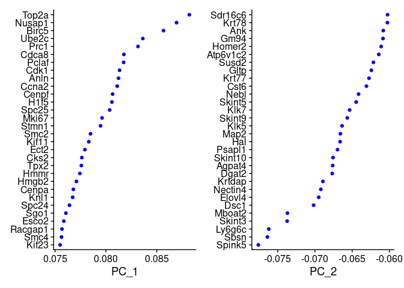<!-- -->

``` r
DimPlot(IFE002, reduction = "pca") + NoLegend()
```

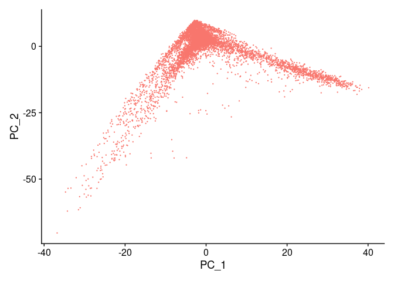<!-- -->

## Cluster

``` r
IFE002 <- FindNeighbors(IFE002, dims = 1:10)
```

    ## Computing nearest neighbor graph

    ## Computing SNN

``` r
IFE002 <- FindClusters(IFE002, resolution = 0.5)
```

    ## Modularity Optimizer version 1.3.0 by Ludo Waltman and Nees Jan van Eck
    ## 
    ## Number of nodes: 9762
    ## Number of edges: 309338
    ## 
    ## Running Louvain algorithm...
    ## Maximum modularity in 10 random starts: 0.8888
    ## Number of communities: 12
    ## Elapsed time: 0 seconds

``` r
head(Idents(IFE002), 5)
```

    ## AAACCCAAGAAGCCTG-1 AAACCCAAGACATCAA-1 AAACCCAAGGATTTGA-1 AAACCCACACTTCAGA-1 
    ##                  5                  1                  0                 10 
    ## AAACCCACATTGCCGG-1 
    ##                  0 
    ## Levels: 0 1 2 3 4 5 6 7 8 9 10 11

## Non-linear dimensional reduction (UMAP/tSNE)

``` r
IFE002 <- RunUMAP(IFE002, dims = 1:10)
```

    ## 01:00:23 UMAP embedding parameters a = 0.9922 b = 1.112

    ## 01:00:23 Read 9762 rows and found 10 numeric columns

    ## 01:00:23 Using Annoy for neighbor search, n_neighbors = 30

    ## 01:00:23 Building Annoy index with metric = cosine, n_trees = 50

    ## 0%   10   20   30   40   50   60   70   80   90   100%

    ## [----|----|----|----|----|----|----|----|----|----|

    ## **************************************************|
    ## 01:00:23 Writing NN index file to temp file /tmp/RtmpNXUUFN/file24dfad6507e0
    ## 01:00:23 Searching Annoy index using 1 thread, search_k = 3000
    ## 01:00:25 Annoy recall = 100%
    ## 01:00:25 Commencing smooth kNN distance calibration using 1 thread with target n_neighbors = 30
    ## 01:00:26 Initializing from normalized Laplacian + noise (using RSpectra)
    ## 01:00:26 Commencing optimization for 500 epochs, with 398686 positive edges
    ## 01:00:31 Optimization finished

``` r
DimPlot(IFE002, reduction = "umap")
```

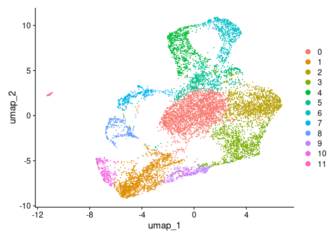<!-- -->

``` r
saveRDS(IFE002, file = "./IFE002_umap.rds")
```

# IFE003

``` r
# Load datasets
IFE003.data <- Read10X(data_dir <- '~/Documents/cellranger/IFE003/outs/filtered_feature_bc_matrix')
# Initialize Seurat Object
IFE003 <- CreateSeuratObject(counts = IFE003.data, project = 'IFE', min.cells = 3, min.features = 200)
```

## Normalizing data — Log normalization, scale = 10000

``` r
IFE003 <- NormalizeData(IFE003)
```

    ## Normalizing layer: counts

## Scaling the data

``` r
all.genes_IFE003 <- rownames(IFE003)
IFE003 <- ScaleData(IFE003, features = all.genes_IFE003)
```

    ## Centering and scaling data matrix

## Linear Dimentional Reduction

``` r
IFE003 <- FindVariableFeatures(IFE003, selection.method = "vst", nfeatures = 2000)
```

    ## Finding variable features for layer counts

``` r
IFE003 <- RunPCA(IFE003, features = VariableFeatures(object = IFE003))
```

    ## PC_ 1 
    ## Positive:  Spink5, Elovl4, Ly6g6c, Sbsn, Mboat2, Dgat2, Psapl1, Dsc1, Klk5, Nectin4 
    ##     Orm1, Gm94, Krt77, Hal, Krtdap, Kctd12, Skint3, Skint10, Them5, Agpat4 
    ##     Calm4, Dnase1l3, Skint5, Susd2, Sdr16c6, Skint9, Dkkl1, Map2, Krt78, Homer2 
    ## Negative:  Cmss1, Rad51b, Kpna1, Gphn, Diaph3, Mki67, Grip1, Pde4d, Anln, S100a6 
    ##     Tpx2, Cenpe, Incenp, Lockd, Cenpf, Ckap2, Ror1, Kif20b, Nckap5, Cit 
    ##     Nusap1, Kif11, Hmmr, Knl1, Mis18bp1, Kif15, Lrrc7, Ect2, H1f5, Birc5 
    ## PC_ 2 
    ## Positive:  Cmss1, Gphn, Kpna1, Cttnbp2, Skint6, Il31ra, Dsc3, Dsp, Scel, Dlg2 
    ##     Naaladl2, Tnik, Ghr, Sorbs1, Dsg1a, Trpm3, Fhit, Notch3, Xkr4, Pkib 
    ##     Sntb1, Niban2, D7Ertd443e, Sema3d, Skint11, Nckap5, Bach2, Cpeb3, Adgrv1, Abca12 
    ## Negative:  Nusap1, Top2a, Birc5, Cdk1, Kif11, Ube2c, Ccna2, Pbk, Sgo1, Knl1 
    ##     Spc25, Cenpf, Spc24, Racgap1, Esco2, Cdca3, Ckap2, Aurkb, Kif23, Mki67 
    ##     Prc1, Hmmr, Ect2, Cenpa, Cdca8, Ccnb2, Tpx2, Mis18bp1, Anln, D17H6S56E-5 
    ## PC_ 3 
    ## Positive:  Cmss1, Gphn, Kpna1, Il31ra, Skint6, Skint5, Nebl, Taco1, Map2, Dlg2 
    ##     Niban2, Tnik, D7Ertd443e, Rgs20, Plxdc2, Srgap2, Abtb2, Abca12, Lor, Mboat2 
    ##     Flg2, Marchf3, Ank, Skint10, Skint3, Adgrf2, Klk7, Cgn, Skint4, Naaladl2 
    ## Negative:  Cst3, Lgals7, Sfn, Jund, Dstn, Ly6d, Lgals3, Itm2b, Tacstd2, S100a6 
    ##     Perp, Prdx2, Map1lc3a, Ybx3, Trim29, Junb, Apoc1, Hspb1, Dynll1, 1810037I17Rik 
    ##     Ifitm2, Rab25, Cstb, Nfkbia, Atp6v0e, Ier2, Serpinb5, Klf4, Dapl1, Zfp706 
    ## PC_ 4 
    ## Positive:  Gm94, Krt1, Krt10, Fam25c, Calm4, Mt4, Hal, Krtdap, Gjb5, 2310050C09Rik 
    ##     Skint6, Rab25, Elovl4, Krt77, Krt78, Dmkn, Skint5, Dsg1a, Sema3d, Ly6g6e 
    ##     Hba-a1, Dapl1, Tesc, Clic3, Fabp5, Gsta2, Dsc3, Oas1f, Flg2, Nupr1 
    ## Negative:  Vim, S100a4, Cd52, Fxyd5, Ptprc, Ctnnd2, Fcer1g, Lcp1, Runx3, Laptm5 
    ##     Rgs1, Coro1a, Emp3, Lgals1, Cytip, Fyb, Id2, Dock10, Dennd4a, Apbb1ip 
    ##     Ikzf1, Lsp1, Lbh, Zeb1, Alcam, St8sia1, Inpp5d, Sox9, Mir142hg, Elmo1 
    ## PC_ 5 
    ## Positive:  Flg2, Cnfn, Csta1, Flg, Crct1, Nccrp1, Lypd5, Serpina12, Rnf227, Anxa9 
    ##     Klk7, Asprv1, Krt23, Wfdc21, Lor, Cysrt1, Wfdc5, Ly6m, Alox12b, Sdr9c7 
    ##     Cdsn, Kprp, Lce1m, Smpd3, Trex2, Dusp18, Il18, Tgm1, Nectin3, Btc 
    ## Negative:  Skint6, Ghr, Scel, Fads2b, Dlg2, Skint4, Micu1, Notch3, Acsl1, Krt1 
    ##     Pkib, Slc12a2, Tmprss4, Plekha6, Hpgds, Dsc3, Sptlc3, Tnik, Man2a1, Skint9 
    ##     Clip4, Slc9a9, Ankrd35, Gab1, Dsg1a, Adgra3, Skint5, Galnt1, D7Ertd443e, Cttnbp2

``` r
print(IFE003[["pca"]], dims = 1:5, nfeature = 5)
```

    ## PC_ 1 
    ## Positive:  Spink5, Elovl4, Ly6g6c, Sbsn, Mboat2 
    ## Negative:  Cmss1, Rad51b, Kpna1, Gphn, Diaph3 
    ## PC_ 2 
    ## Positive:  Cmss1, Gphn, Kpna1, Cttnbp2, Skint6 
    ## Negative:  Nusap1, Top2a, Birc5, Cdk1, Kif11 
    ## PC_ 3 
    ## Positive:  Cmss1, Gphn, Kpna1, Il31ra, Skint6 
    ## Negative:  Cst3, Lgals7, Sfn, Jund, Dstn 
    ## PC_ 4 
    ## Positive:  Gm94, Krt1, Krt10, Fam25c, Calm4 
    ## Negative:  Vim, S100a4, Cd52, Fxyd5, Ptprc 
    ## PC_ 5 
    ## Positive:  Flg2, Cnfn, Csta1, Flg, Crct1 
    ## Negative:  Skint6, Ghr, Scel, Fads2b, Dlg2

``` r
VizDimLoadings(IFE003, dims = 1:2, reduction = "pca")
```

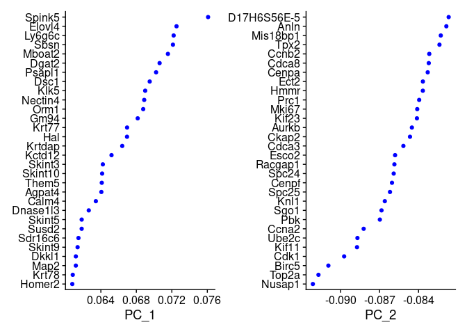<!-- -->

``` r
DimPlot(IFE003, reduction = "pca") + NoLegend()
```

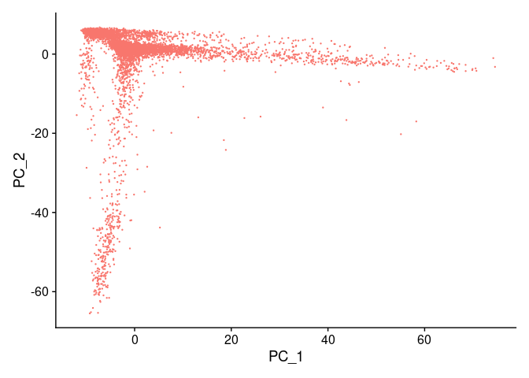<!-- -->

## Cluster

``` r
IFE003 <- FindNeighbors(IFE003, dims = 1:10)
```

    ## Computing nearest neighbor graph

    ## Computing SNN

``` r
IFE003 <- FindClusters(IFE003, resolution = 0.5)
```

    ## Modularity Optimizer version 1.3.0 by Ludo Waltman and Nees Jan van Eck
    ## 
    ## Number of nodes: 8417
    ## Number of edges: 266706
    ## 
    ## Running Louvain algorithm...
    ## Maximum modularity in 10 random starts: 0.8921
    ## Number of communities: 15
    ## Elapsed time: 0 seconds

``` r
head(Idents(IFE003), 5)
```

    ## AAACCCAAGCATGTTC-1 AAACCCACAAGGCAAC-1 AAACCCACACTCCGGA-1 AAACCCACATCTTAGG-1 
    ##                  0                  0                  1                  4 
    ## AAACCCAGTATTTCTC-1 
    ##                  4 
    ## Levels: 0 1 2 3 4 5 6 7 8 9 10 11 12 13 14

## Non-linear dimensional reduction (UMAP/tSNE)

``` r
IFE003 <- RunUMAP(IFE003, dims = 1:10)
```

    ## 01:01:58 UMAP embedding parameters a = 0.9922 b = 1.112

    ## 01:01:58 Read 8417 rows and found 10 numeric columns

    ## 01:01:58 Using Annoy for neighbor search, n_neighbors = 30

    ## 01:01:58 Building Annoy index with metric = cosine, n_trees = 50

    ## 0%   10   20   30   40   50   60   70   80   90   100%

    ## [----|----|----|----|----|----|----|----|----|----|

    ## **************************************************|
    ## 01:01:58 Writing NN index file to temp file /tmp/RtmpNXUUFN/file24dfa564f2fde
    ## 01:01:58 Searching Annoy index using 1 thread, search_k = 3000
    ## 01:02:00 Annoy recall = 100%
    ## 01:02:01 Commencing smooth kNN distance calibration using 1 thread with target n_neighbors = 30
    ## 01:02:02 Initializing from normalized Laplacian + noise (using RSpectra)
    ## 01:02:02 Commencing optimization for 500 epochs, with 344852 positive edges
    ## 01:02:07 Optimization finished

``` r
DimPlot(IFE003, reduction = "umap")
```

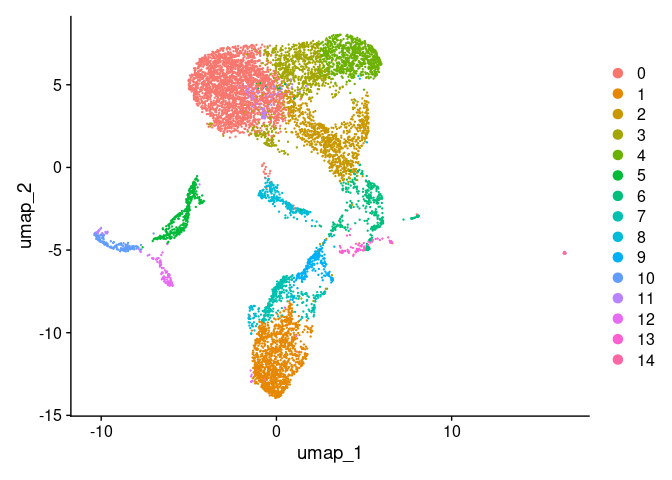<!-- -->

``` r
saveRDS(IFE003, file = "./IFE003_umap.rds")
```

# TD001

``` r
# Load datasets
TD001.data <- Read10X(data_dir <- '~/Documents/cellranger/TD001/outs/filtered_feature_bc_matrix')
# Initialize Seurat Object
TD001 <- CreateSeuratObject(counts = TD001.data, project = 'TD', min.cells = 3, min.features = 200)
```

## Normalizing data — Log normalization, scale = 10000

``` r
TD001 <- NormalizeData(TD001)
```

    ## Normalizing layer: counts

## Scaling the data

``` r
all.genes_TD001 <- rownames(TD001)
TD001 <- ScaleData(TD001, features = all.genes_TD001)
```

    ## Centering and scaling data matrix

## Linear Dimentional Reduction

``` r
TD001 <- FindVariableFeatures(TD001, selection.method = "vst", nfeatures = 2000)
```

    ## Finding variable features for layer counts

``` r
TD001 <- RunPCA(TD001, features = VariableFeatures(object = TD001))
```

    ## PC_ 1 
    ## Positive:  Krtdap, Sbsn, Gm94, Calm4, Krt77, Fam25c, Spink5, Dmkn, Krt10, Ly6g6c 
    ##     Hspb1, Elovl4, Flg2, Skint5, Dapl1, Hal, Prdx5, Klk7, Dsg1a, Orm1 
    ##     Mboat2, Asprv1, Fabp5, Gltp, 2310050C09Rik, Clic3, Krt1, Kctd12, Wfdc21, Psapl1 
    ## Negative:  Adgrl3, Fst, Alcam, Diaph3, Prlr, S100a6, Abi3bp, Hmcn1, Top2a, H1f5 
    ##     Postn, Ltbp1, Ror1, Lockd, Mki67, Anln, Pclaf, H2ac8, Stmn1, Clic4 
    ##     Atad2, Kif15, Fmnl2, Hells, Neil3, D17H6S56E-5, Ncapg2, Cenpp, Knl1, Ckap2 
    ## PC_ 2 
    ## Positive:  Skint6, Dlg2, Slc24a3, Ghr, Slco3a1, Skint5, Tnik, Rora, Cttnbp2, Naaladl2 
    ##     Krt77, Krt10, Gm2164, Kif26b, Fhit, Gm9750, Abca12, D7Ertd443e, Notch3, Dsg1a 
    ##     Klf12, Krt1, Nebl, Sorbs1, Tprg, Plxdc2, Abtb2, Plekha5, Slit3, Sema3d 
    ## Negative:  Top2a, Cenpf, Nusap1, Prc1, Mki67, H1f5, Hmgb2, Ube2c, Anln, H2ac8 
    ##     Cdca8, H2ac24, Birc5, Cenpa, Kif11, Ckap2, Knl1, Kif23, Stmn1, Hmmr 
    ##     Smc2, D17H6S56E-5, Cdk1, Tpx2, H2az1, Esco2, Lockd, Aspm, H2ax, Pclaf 
    ## PC_ 3 
    ## Positive:  Crct1, Lce1m, Btc, Lor, Il18, Flg, Csta1, Asprv1, Rnf227, Ly6m 
    ##     Ctsl, Flg2, Cnfn, Wfdc21, Krt23, Smpd3, Klk7, Cysrt1, Lypd5, Nccrp1 
    ##     Trex2, Serpina12, Alox12b, Tmprss11f, Aif1l, Tgm1, Spns2, Anxa9, Scgb1a1, Sod3 
    ## Negative:  Krt1, Lgals3, Dsg1a, Skint6, Mt4, Gata3, Anxa2, Sfn, Dbi, Skint5 
    ##     Fads2b, Krt10, Micu1, Perp, Tmprss4, Serpinb5, Krt77, Sema3d, Pou3f1, Slc24a3 
    ##     Dsp, Phactr2, 1810037I17Rik, Slco3a1, Skint9, Slc12a2, Ghr, Tnik, Fabp5, Pycard 
    ## PC_ 4 
    ## Positive:  H2-Ab1, H2-Aa, Cd74, H2-Eb1, H2-M2, Vim, Prkcb, Cd52, Fcer1g, Elmo1 
    ##     Fxyd5, Cd207, Tyrobp, Gpr141, Cacnb2, Tnfaip2, Lcp1, S100a4, Cacna1e, Runx3 
    ##     Ctss, H2-M5, Ctnnd2, Ltc4s, Ptprc, H2-DMa, H2-DMb1, Mfge8, Dennd4a, Tbc1d4 
    ## Negative:  Skint6, Skint5, Gm9750, Krt77, Krt10, Plxdc2, Tnik, Ghr, Slco3a1, Dsp 
    ##     Micu1, Slc24a3, Dsg1a, Skint11, Sptlc3, Sema3d, Cttnbp2, Tprg, Fads2b, Rgs20 
    ##     D7Ertd443e, Pla2g4f, Mboat2, Sorbs1, Clip4, Notch3, Skint9, Krt1, Krtdap, Agpat4 
    ## PC_ 5 
    ## Positive:  Rplp0, Ly6d, Jund, Actg1, Junb, S100a6, Fth1, Cstb, Gstm5, Hras 
    ##     Atp5d, Edf1, Mt1, Ier2, Ndufa4, Sfn, Defb6, Jun, Btg2, Cebpb 
    ##     Egr1, Zfp36, Perp, Ier3, Prdx2, Dynll1, Dbi, Krt17, Fst, Lgals3 
    ## Negative:  Skint5, Skint6, Slco3a1, Tnik, Gm9750, Srgap2, Phactr2, Sorbs1, Plekha5, Dlg2 
    ##     Sema3d, Slc24a3, Map2, D7Ertd443e, Cobl, Slc9a9, Abca12, Abtb2, Plxdc2, Mboat2 
    ##     Micu1, Skint11, Klf12, Ghr, Gm2164, Mki67, Hpgds, Krt10, Krt77, Sox6

``` r
print(TD001[["pca"]], dims = 1:5, nfeature = 5)
```

    ## PC_ 1 
    ## Positive:  Krtdap, Sbsn, Gm94, Calm4, Krt77 
    ## Negative:  Adgrl3, Fst, Alcam, Diaph3, Prlr 
    ## PC_ 2 
    ## Positive:  Skint6, Dlg2, Slc24a3, Ghr, Slco3a1 
    ## Negative:  Top2a, Cenpf, Nusap1, Prc1, Mki67 
    ## PC_ 3 
    ## Positive:  Crct1, Lce1m, Btc, Lor, Il18 
    ## Negative:  Krt1, Lgals3, Dsg1a, Skint6, Mt4 
    ## PC_ 4 
    ## Positive:  H2-Ab1, H2-Aa, Cd74, H2-Eb1, H2-M2 
    ## Negative:  Skint6, Skint5, Gm9750, Krt77, Krt10 
    ## PC_ 5 
    ## Positive:  Rplp0, Ly6d, Jund, Actg1, Junb 
    ## Negative:  Skint5, Skint6, Slco3a1, Tnik, Gm9750

``` r
VizDimLoadings(TD001, dims = 1:2, reduction = "pca")
```

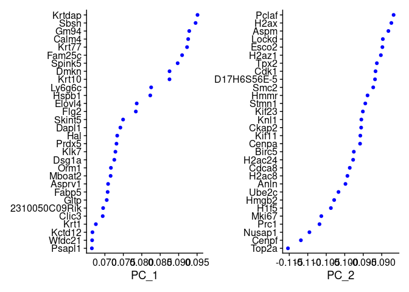<!-- -->

``` r
DimPlot(TD001, reduction = "pca") + NoLegend()
```

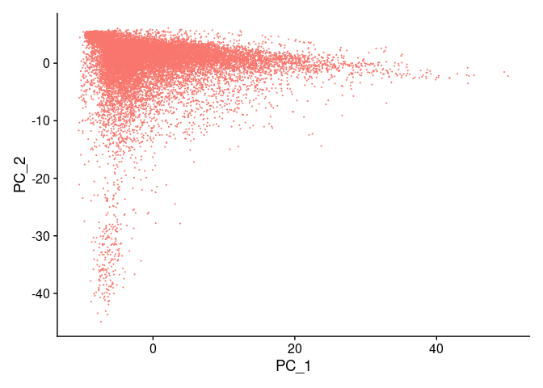<!-- -->

## Cluster

``` r
TD001 <- FindNeighbors(TD001, dims = 1:10)
```

    ## Computing nearest neighbor graph

    ## Computing SNN

``` r
TD001 <- FindClusters(TD001, resolution = 0.5)
```

    ## Modularity Optimizer version 1.3.0 by Ludo Waltman and Nees Jan van Eck
    ## 
    ## Number of nodes: 18162
    ## Number of edges: 534280
    ## 
    ## Running Louvain algorithm...
    ## Maximum modularity in 10 random starts: 0.8716
    ## Number of communities: 16
    ## Elapsed time: 1 seconds

``` r
head(Idents(TD001), 5)
```

    ## AAACCCAAGATTGGGC-1 AAACCCAAGCGTTGTT-1 AAACCCAAGGTATAGT-1 AAACCCAAGTATGATG-1 
    ##                  0                  0                  0                  4 
    ## AAACCCAAGTCAATCC-1 
    ##                  9 
    ## Levels: 0 1 2 3 4 5 6 7 8 9 10 11 12 13 14 15

## Non-linear dimensional reduction (UMAP/tSNE)

``` r
TD001 <- RunUMAP(TD001, dims = 1:10)
```

    ## 01:03:43 UMAP embedding parameters a = 0.9922 b = 1.112

    ## 01:03:43 Read 18162 rows and found 10 numeric columns

    ## 01:03:43 Using Annoy for neighbor search, n_neighbors = 30

    ## 01:03:43 Building Annoy index with metric = cosine, n_trees = 50

    ## 0%   10   20   30   40   50   60   70   80   90   100%

    ## [----|----|----|----|----|----|----|----|----|----|

    ## **************************************************|
    ## 01:03:44 Writing NN index file to temp file /tmp/RtmpNXUUFN/file24dfa4819376d
    ## 01:03:44 Searching Annoy index using 1 thread, search_k = 3000
    ## 01:03:48 Annoy recall = 100%
    ## 01:03:48 Commencing smooth kNN distance calibration using 1 thread with target n_neighbors = 30
    ## 01:03:49 Initializing from normalized Laplacian + noise (using RSpectra)
    ## 01:03:49 Commencing optimization for 200 epochs, with 751344 positive edges
    ## 01:03:53 Optimization finished

``` r
DimPlot(TD001, reduction = "umap")
```

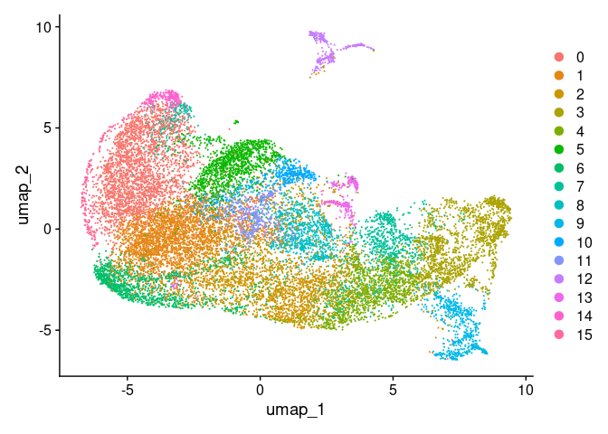<!-- -->

``` r
saveRDS(TD001, file = "./TD001_umap.rds")
```

# TD002

``` r
# Load datasets
TD002.data <- Read10X(data_dir <- '~/Documents/cellranger/TD002/outs/filtered_feature_bc_matrix')
# Initialize Seurat Object
TD002 <- CreateSeuratObject(counts = TD002.data, project = 'TD', min.cells = 3, min.features = 200)
```

## Normalizing data — Log normalization, scale = 10000

``` r
TD002 <- NormalizeData(TD002)
```

    ## Normalizing layer: counts

## Scaling the data

``` r
all.genes_TD002 <- rownames(TD002)
TD002 <- ScaleData(TD002, features = all.genes_TD002)
```

    ## Centering and scaling data matrix

## Linear Dimentional Reduction

``` r
TD002 <- FindVariableFeatures(TD002, selection.method = "vst", nfeatures = 2000)
```

    ## Finding variable features for layer counts

``` r
TD002 <- RunPCA(TD002, features = VariableFeatures(object = TD002))
```

    ## PC_ 1 
    ## Positive:  Dsg1a, Elovl4, Krt77, Sbsn, Ly6g6c, Krtdap, Gltp, Fam25c, Calm4, Spink5 
    ##     Dmkn, Krt10, Nectin4, Pla2g2f, Tmprss4, Ptgs1, Dsc1, Abca12, Fads2b, Lypd3 
    ##     Fabp5, Them5, Agpat4, Cdkn1a, Psapl1, Tprg, Gm94, Rab25, Acsl1, Prdx5 
    ## Negative:  Rad51b, Mki67, Diaph3, Ptn, Anln, Kif15, Cenpf, Knl1, Lockd, Tpx2 
    ##     Nusap1, Cenpe, Kif11, Kif20b, D17H6S56E-5, Rbms3, Esco2, Cit, Top2a, Cenpp 
    ##     H1f5, Racgap1, Incenp, Hmmr, Aspm, Cdk1, Iqgap3, Neil3, Prc1, Mis18bp1 
    ## PC_ 2 
    ## Positive:  Gm19951, Dlg2, Skint6, Slco3a1, Tprg, Slc24a3, Plekha6, Nav2, Naaladl2, Cttnbp2 
    ##     Atg4a, Nfatc2, Thrb, Tnik, Ghr, Thsd4, Gm2164, Dsp, D7Ertd443e, Atp10b 
    ##     Arhgef10l, Adgrf2, 9530059O14Rik, Prkcq, Abca12, Srgap1, Kif26b, Skint5, Aadacl2, Nlrp1b 
    ## Negative:  Pclaf, Hmgb2, H1f5, Birc5, Cdk1, Pbk, H2ac24, Nusap1, Top2a, Esco2 
    ##     Spc25, H2az1, Ccna2, H2ac10, Cdca8, Spc24, H2ac8, Stmn1, Sgo1, D17H6S56E-5 
    ##     Prc1, Tubb5, Tuba1b, Ube2c, H3c3, H2ax, Aurkb, Cks2, H4c4, Smc2 
    ## PC_ 3 
    ## Positive:  Jund, Ly6d, Krt14, Aqp3, Cstb, Lgals7, S100a6, Tmsb10, Gapdh, Dstn 
    ##     Uqcrq, Ndufa4, Krt5, Hspb1, Calm1, Junb, Perp, Fth1, Sfn, Ldha 
    ##     Tacstd2, Fst, Mpc2, Hspd1, Scp2, Plet1, Dynll1, Rbp1, Ier2, Pycard 
    ## Negative:  Skint6, Skint5, Slco3a1, Gm9750, Tnik, Skint11, Map2, Tprg, Phactr2, Cobl 
    ##     Mboat2, Abca12, Dlg2, Pla2g4f, Srgap2, Aadacl2, Ttk, Klf12, Sema3d, Gm19951 
    ##     Micu1, D7Ertd443e, Gm2164, Arhgef10l, Slc24a3, Slc9a9, Sorbs1, Slc6a20a, Srgap1, Ghr 
    ## PC_ 4 
    ## Positive:  Fth1, Krt5, Sox6, Mt1, Gata3, Pou3f1, Fam162a, Mt2, Ndufa4l2, Sema3d 
    ##     Phactr2, Ext1, Il6ra, Hlf, Cxcl14, Wnt3, Satb1, Ly6a, Slc24a3, Limch1 
    ##     Slco2a1, Gja1, Lrp4, Slco3a1, Klf12, Il20ra, Urah, Gadl1, Antxr1, Maf 
    ## Negative:  Defb6, Krt79, Cst6, Nebl, Sprr1a, Crabp2, Calml3, Atp6v1c2, Sdr16c6, Sema6a 
    ##     Klk7, Teddm3, Rbp1, Psapl1, Gdpd1, Lbh, Gsdma, Anpep, Qsox1, Marcks 
    ##     Myo5b, Ivl, Slc46a2, Ly6g6c, Slc43a2, Slc40a1, Muc15, Pdzrn3, Garem1, Endod1 
    ## PC_ 5 
    ## Positive:  Trbc2, Oas1f, Calm4, Fam25c, Pou3f1, Dbi, Dapl1, Lgals3, Rab25, Orm1 
    ##     Krt1, Susd2, Fabp5, Ly6g6e, Stfa3, Krt10, Cstdc5, Nhp2, Aldh3b2, Krtdap 
    ##     Pycard, Prdx5, 1810037I17Rik, Krt77, Ly6g6c, Cebpa, Gcat, Clic3, Stfa1, Hebp2 
    ## Negative:  Sema3e, Gpc6, Robo2, Lhx2, Alcam, Ank, Thsd1, Farp1, Pdzrn3, Grem1 
    ##     Serpinb11, Maml2, Plpp1, Myo1b, Rflnb, Auts2, Arhgap24, Pcdh7, Cpe, Tshz2 
    ##     Tgfb2, Naaladl2, Ccn2, Ntf3, Sema6a, Col5a2, Sgcd, Lgr6, Palld, Hk2

``` r
print(TD002[["pca"]], dims = 1:5, nfeature = 5)
```

    ## PC_ 1 
    ## Positive:  Dsg1a, Elovl4, Krt77, Sbsn, Ly6g6c 
    ## Negative:  Rad51b, Mki67, Diaph3, Ptn, Anln 
    ## PC_ 2 
    ## Positive:  Gm19951, Dlg2, Skint6, Slco3a1, Tprg 
    ## Negative:  Pclaf, Hmgb2, H1f5, Birc5, Cdk1 
    ## PC_ 3 
    ## Positive:  Jund, Ly6d, Krt14, Aqp3, Cstb 
    ## Negative:  Skint6, Skint5, Slco3a1, Gm9750, Tnik 
    ## PC_ 4 
    ## Positive:  Fth1, Krt5, Sox6, Mt1, Gata3 
    ## Negative:  Defb6, Krt79, Cst6, Nebl, Sprr1a 
    ## PC_ 5 
    ## Positive:  Trbc2, Oas1f, Calm4, Fam25c, Pou3f1 
    ## Negative:  Sema3e, Gpc6, Robo2, Lhx2, Alcam

``` r
VizDimLoadings(TD002, dims = 1:2, reduction = "pca")
```

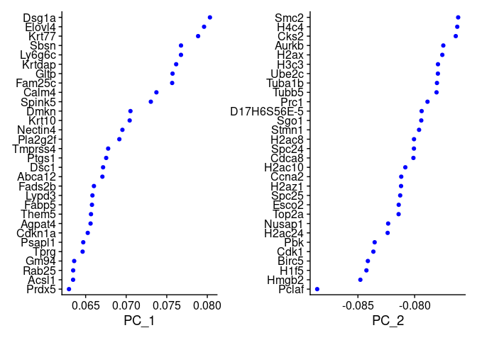<!-- -->

``` r
DimPlot(TD002, reduction = "pca") + NoLegend()
```

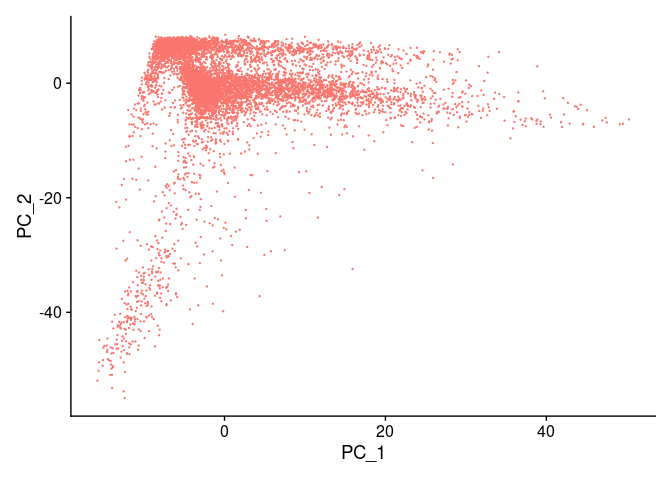<!-- -->

## Cluster

``` r
TD002 <- FindNeighbors(TD002, dims = 1:10)
```

    ## Computing nearest neighbor graph

    ## Computing SNN

``` r
TD002 <- FindClusters(TD002, resolution = 0.5)
```

    ## Modularity Optimizer version 1.3.0 by Ludo Waltman and Nees Jan van Eck
    ## 
    ## Number of nodes: 8847
    ## Number of edges: 278900
    ## 
    ## Running Louvain algorithm...
    ## Maximum modularity in 10 random starts: 0.8878
    ## Number of communities: 14
    ## Elapsed time: 0 seconds

``` r
head(Idents(TD002), 5)
```

    ## AAACCCAAGATAGCAT-1 AAACCCAGTGCTCGTG-1 AAACCCATCCGTGGGT-1 AAACGAAGTCATGACT-1 
    ##                  1                  4                  1                  3 
    ## AAACGAAGTCCGAAAG-1 
    ##                  7 
    ## Levels: 0 1 2 3 4 5 6 7 8 9 10 11 12 13

## Non-linear dimensional reduction (UMAP/tSNE)

``` r
TD002 <- RunUMAP(TD002, dims = 1:10)
```

    ## 01:06:14 UMAP embedding parameters a = 0.9922 b = 1.112

    ## 01:06:14 Read 8847 rows and found 10 numeric columns

    ## 01:06:14 Using Annoy for neighbor search, n_neighbors = 30

    ## 01:06:14 Building Annoy index with metric = cosine, n_trees = 50

    ## 0%   10   20   30   40   50   60   70   80   90   100%

    ## [----|----|----|----|----|----|----|----|----|----|

    ## **************************************************|
    ## 01:06:15 Writing NN index file to temp file /tmp/RtmpNXUUFN/file24dfa171d4fe4
    ## 01:06:15 Searching Annoy index using 1 thread, search_k = 3000
    ## 01:06:17 Annoy recall = 100%
    ## 01:06:18 Commencing smooth kNN distance calibration using 1 thread with target n_neighbors = 30
    ## 01:06:18 Initializing from normalized Laplacian + noise (using RSpectra)
    ## 01:06:18 Commencing optimization for 500 epochs, with 360274 positive edges
    ## 01:06:23 Optimization finished

``` r
DimPlot(TD002, reduction = "umap")
```

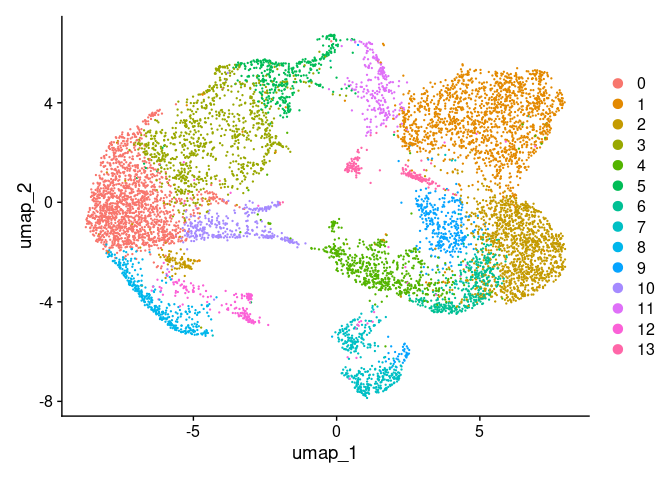<!-- -->

``` r
saveRDS(TD002, file = "./TD002_umap.rds")
```

# TD003

``` r
# Load datasets
TD003.data <- Read10X(data_dir <- '~/Documents/cellranger/TD003/outs/filtered_feature_bc_matrix')
# Initialize Seurat Object
TD003 <- CreateSeuratObject(counts = TD003.data, project = 'TD', min.cells = 3, min.features = 200)
```

## Normalizing data — Log normalization, scale = 10000

``` r
TD003 <- NormalizeData(TD003)
```

    ## Normalizing layer: counts

## Scaling the data

``` r
all.genes_TD003 <- rownames(TD003)
TD003 <- ScaleData(TD003, features = all.genes_TD003)
```

    ## Centering and scaling data matrix

## Linear Dimentional Reduction

``` r
TD003 <- FindVariableFeatures(TD003, selection.method = "vst", nfeatures = 2000)
```

    ## Finding variable features for layer counts

``` r
TD003 <- RunPCA(TD001, features = VariableFeatures(object = TD003))
```

    ## Warning in PrepDR5(object = object, features = features, layer = layer, : The
    ## following features were not available: AA467197, Gm56862, Gm13842, Gnasas1,
    ## Gm27211, Trarg1, I730030J21Rik, Gm33543.

    ## PC_ 1 
    ## Positive:  Alcam, Diaph3, 9530026P05Rik, S100a6, Top2a, H1f5, Hmcn1, Postn, Lockd, Mki67 
    ##     Ltbp1, Anln, H2ac8, Pclaf, Ror1, Stmn1, Atad2, Clic4, Kif15, Hells 
    ##     D17H6S56E-5, Neil3, Fmnl2, H2ac24, Knl1, Cenpp, Ism1, Nsd2, Ncapg2, Kif11 
    ## Negative:  Krtdap, Sbsn, Krt77, Calm4, Gm94, Fam25c, Spink5, Krt10, Dmkn, Ly6g6c 
    ##     Hspb1, Elovl4, Skint5, Flg2, Dapl1, Dsg1a, Prdx5, Hal, Mboat2, Fabp5 
    ##     Gltp, Orm1, Klk7, Krt1, Skint6, Clic3, Asprv1, 2310050C09Rik, Kctd12, Psapl1 
    ## PC_ 2 
    ## Positive:  Skint6, Dlg2, Slc24a3, Ghr, Slco3a1, Skint5, Thrb, Rora, Naaladl2, Cttnbp2 
    ##     Tnik, Kif26b, Krt77, Gm2164, Krt10, Nipal2, Sntb1, Kdm5b, Fhit, Abca12 
    ##     Notch3, Gm9750, Nebl, D7Ertd443e, Tprg, Krtdap, Klf12, Dsg1a, Nlrp1b, Krt1 
    ## Negative:  Top2a, Cenpf, Nusap1, Mki67, Prc1, H1f5, Hmgb2, Ube2c, Anln, H2ac8 
    ##     Cdca8, H2ac24, Birc5, Kif11, Knl1, Ckap2, Kif23, Cenpa, Stmn1, Hmmr 
    ##     Smc2, D17H6S56E-5, Cdk1, Tpx2, Esco2, Lockd, H2az1, Aspm, Pclaf, H2ax 
    ## PC_ 3 
    ## Positive:  Lgals7, Skint6, Krt1, Anxa8, Dsc3, Gata3, Dsg1a, Lgals3, Micu1, Anxa2 
    ##     Fads2b, Slc24a3, Ghr, Mt4, Chl1, Skint5, Sfn, Slco3a1, Dbi, Phactr2 
    ##     Dlg2, Dsp, Sema3d, Slc12a2, Tmprss4, Tnik, Pou3f1, Skint9, Serpinb5, Perp 
    ## Negative:  Crct1, Lor, Lce1m, Btc, Asprv1, Csta1, Flg, Il18, Flg2, Rnf227 
    ##     Wfdc21, Ly6m, Ctsl, Cnfn, Krt23, Smpd3, Klk7, Cysrt1, Lypd5, Nccrp1 
    ##     Serpina12, Trex2, Alox12b, Tmprss11f, Anxa9, Tgm1, Aif1l, Spns2, Elmod1, F3 
    ## PC_ 4 
    ## Positive:  H2-Ab1, H2-Aa, Cd74, H2-Eb1, H2-M2, Vim, Prkcb, Cd52, Elmo1, Fcer1g 
    ##     Fxyd5, Cd207, Tyrobp, Gpr141, Cacnb2, Tnfaip2, Lcp1, Runx3, S100a4, Cacna1e 
    ##     Ctss, H2-M5, Ctnnd2, Ptprc, Ltc4s, Mfge8, H2-DMa, H2-DMb1, Dennd4a, Tbc1d4 
    ## Negative:  Skint6, Lgals7, Skint5, Gm9750, Plxdc2, Chl1, Ghr, Dsp, Krt79, Krt77 
    ##     Tnik, Krt10, Slco3a1, Micu1, Slc24a3, Cst6, Cttnbp2, Sptlc3, Dsg1a, Skint11 
    ##     Rgs20, Tprg, Dsc3, Notch3, Clip4, Fads2b, Nipal2, Pla2g4f, Gng12, Pof1b 
    ## PC_ 5 
    ## Positive:  Rplp0, Lgals7, Ly6d, Actg1, Fth1, Jund, S100a6, Junb, Mt1, Cstb 
    ##     Sfn, Hras, Lgals3, Dynll1, Perp, Ndufa4, Dbi, Ier2, Itm2b, Defb6 
    ##     Jun, Btg2, Anxa8, Prdx2, Anxa2, Capns2, Dstn, Zfp36, Hspb1, Egr1 
    ## Negative:  Skint6, Skint5, Slco3a1, Srgap2, Tnik, Taco1, Gm9750, Dlg2, Sorbs1, Plxdc2 
    ##     Plekha5, Slc24a3, Phactr2, Slc9a9, Cobl, Map2, Ghr, Abca12, Nipal2, Abtb2 
    ##     D7Ertd443e, Gm2164, Klf12, Sema3d, Atrnl1, Macf1, Pak3, Fut8, Micu1, Efna5

``` r
print(TD003[["pca"]], dims = 1:5, nfeature = 5)
```

    ## PC_ 1 
    ## Positive:  Alcam, Diaph3, 9530026P05Rik, S100a6, Top2a 
    ## Negative:  Krtdap, Sbsn, Krt77, Calm4, Gm94 
    ## PC_ 2 
    ## Positive:  Skint6, Dlg2, Slc24a3, Ghr, Slco3a1 
    ## Negative:  Top2a, Cenpf, Nusap1, Mki67, Prc1 
    ## PC_ 3 
    ## Positive:  Lgals7, Skint6, Krt1, Anxa8, Dsc3 
    ## Negative:  Crct1, Lor, Lce1m, Btc, Asprv1 
    ## PC_ 4 
    ## Positive:  H2-Ab1, H2-Aa, Cd74, H2-Eb1, H2-M2 
    ## Negative:  Skint6, Lgals7, Skint5, Gm9750, Plxdc2 
    ## PC_ 5 
    ## Positive:  Rplp0, Lgals7, Ly6d, Actg1, Fth1 
    ## Negative:  Skint6, Skint5, Slco3a1, Srgap2, Tnik

``` r
VizDimLoadings(TD003, dims = 1:2, reduction = "pca")
```

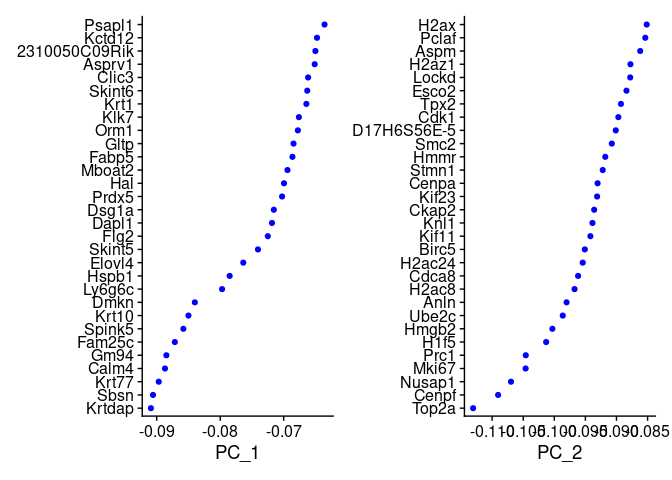<!-- -->

``` r
DimPlot(TD003, reduction = "pca") + NoLegend()
```

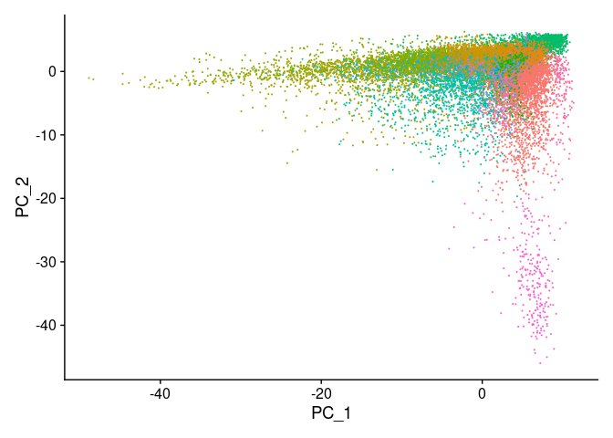<!-- -->

## Cluster

``` r
TD001 <- FindNeighbors(TD003, dims = 1:10)
```

    ## Computing nearest neighbor graph

    ## Computing SNN

``` r
TD001 <- FindClusters(TD003, resolution = 0.5)
```

    ## Modularity Optimizer version 1.3.0 by Ludo Waltman and Nees Jan van Eck
    ## 
    ## Number of nodes: 18162
    ## Number of edges: 534280
    ## 
    ## Running Louvain algorithm...
    ## Maximum modularity in 10 random starts: 0.8716
    ## Number of communities: 16
    ## Elapsed time: 1 seconds

``` r
head(Idents(TD003), 5)
```

    ## AAACCCAAGATTGGGC-1 AAACCCAAGCGTTGTT-1 AAACCCAAGGTATAGT-1 AAACCCAAGTATGATG-1 
    ##                  0                  0                  0                  4 
    ## AAACCCAAGTCAATCC-1 
    ##                  9 
    ## Levels: 0 1 2 3 4 5 6 7 8 9 10 11 12 13 14 15

## Non-linear dimensional reduction (UMAP/tSNE)

``` r
TD003 <- RunUMAP(TD003, dims = 1:10)
```

    ## 01:07:52 UMAP embedding parameters a = 0.9922 b = 1.112

    ## 01:07:52 Read 18162 rows and found 10 numeric columns

    ## 01:07:52 Using Annoy for neighbor search, n_neighbors = 30

    ## 01:07:52 Building Annoy index with metric = cosine, n_trees = 50

    ## 0%   10   20   30   40   50   60   70   80   90   100%

    ## [----|----|----|----|----|----|----|----|----|----|

    ## **************************************************|
    ## 01:07:53 Writing NN index file to temp file /tmp/RtmpNXUUFN/file24dfa45678b55
    ## 01:07:53 Searching Annoy index using 1 thread, search_k = 3000
    ## 01:07:57 Annoy recall = 100%
    ## 01:07:57 Commencing smooth kNN distance calibration using 1 thread with target n_neighbors = 30
    ## 01:07:58 Initializing from normalized Laplacian + noise (using RSpectra)
    ## 01:07:58 Commencing optimization for 200 epochs, with 747322 positive edges
    ## 01:08:02 Optimization finished

``` r
DimPlot(TD003, reduction = "umap")
```

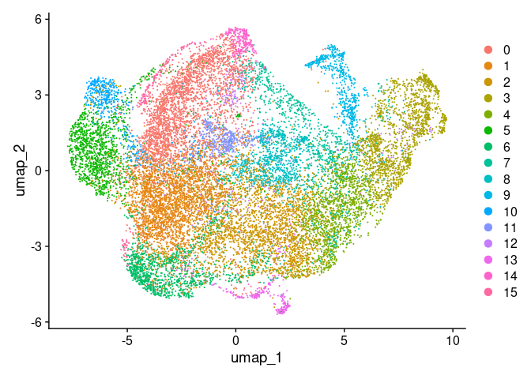<!-- -->

``` r
saveRDS(TD003, file = "./TD003_umap.rds")
```
